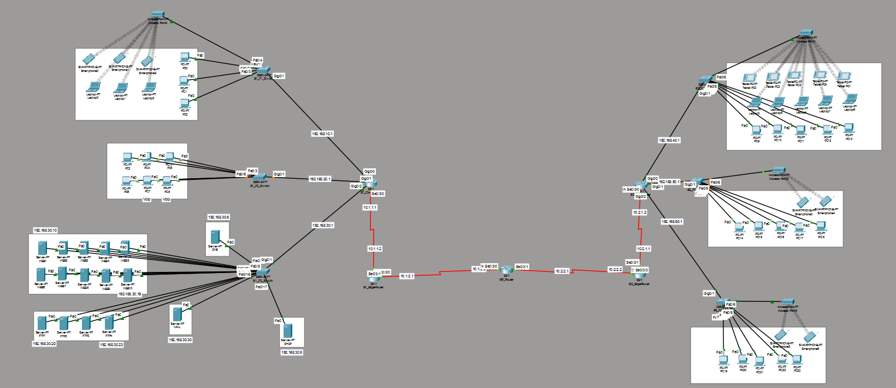

# Metropolitan Area Network (MAN) Simulation

 

## Overview
This repository contains a comprehensive discrete-event network simulation of a Metropolitan Area Network (MAN) designed using Cisco Packet Tracer. The infrastructure connects two geographically distinct branch offices within the same metropolitan area through a dedicated Internet Service Provider (ISP) backbone. 

The primary objective of this architecture is to provide a highly scalable, centralized, and reliable network capable of handling multi-protocol traffic (HTTP, FTP, SMTP/POP3, VoIP, and SSH) while ensuring secure wireless mobility and dynamic IP allocation.

## Key Technologies & Network Logic
* **Dynamic Routing:** OSPF (Open Shortest Path First) is implemented across the Core, Edge, and ISP routers for fast convergence and dynamic path selection.
* **WAN Infrastructure:** The wide-area connection is simulated using a single, dedicated ISP router via point-to-point serial links (No Cloud simulation and no NAT were utilized in this architectural design).
* **Centralized Services:** A dedicated Server Farm hosts all critical infrastructure services (DNS, DHCP, Web, FTP, Mail) to streamline administration.
* **DHCP Relay:** `ip helper-address` configurations on branch routers allow cross-WAN DHCP allocation from the centralized server to end-user facilities.
* **VoIP Integration:** Cisco Call Manager Express (CME) manages SIP/SCCP signaling and RTP payloads for internal voice communications.
* **Secure Remote Access:** Legacy Telnet is disabled; remote administration of core infrastructure is secured via SSH (Port 22).
* **Wireless Security:** WPA2-PSK encryption safeguards mobile and laptop endpoints across multiple distinct SSIDs.

## Network Architecture

### Branch 1 (Headquarters & Server Farm)
* **Facility 1:** Mixed-use environment supporting wired workstations, wireless laptops (`B1_F1_Wifi`), and smartphones.
* **Facility 2 (VoIP & Data):** Wired workstations configured for dual-purpose traffic, including dedicated IP Communicator softphones for VoIP conferencing.
* **Facility 3 (Server Farm):** The centralized brain of the network, housing 10 Web servers, 4 FTP servers, a DNS server, a DHCP server, and a Mail server. 

### Branch 2 (End-User Facilities)
* **Facility 1:** General end-user workspace supporting wireless laptops (`B2_F1_Wifi`), tablets, and workstations.
* **Facility 2:** Engineering and development workspace with wired workstations accessing the remote Server Farm via FTP.
* **Facility 3:** Mobile-first environment equipped with wireless smartphones/tablets (`B2_F3_Wifi`) utilized by network administrators for remote SSH management.

## Validated Traffic Scenarios
The simulation has been rigorously tested using Packet Tracer's discrete-event simulation mode to verify OSI layer encapsulation and end-to-end routing. The following scenarios are documented and proven functional:

1. **Web & Email (Wireless):** HTTP (Port 80) and POP3 (Port 110) traffic originating from a wireless laptop in Branch 2 to the Server Farm.
2. **FTP File Upload:** Multi-channel TCP (Ports 20/21) file transfer from a Branch 2 workstation crossing the ISP backbone to Branch 1.
3. **VoIP Conferencing:** Real-time UDP/RTP voice traffic stream and SCCP call signaling between two softphone users.
4. **Internal Mail Routing:** SMTP (Port 25) packet flow from an internal client to the centralized Mail Server.
5. **End-to-End ICMP:** Layer 3 verification proving OSPF convergence across the ISP backbone.
6. **Wireless SMTP:** WPA2-encrypted 802.11 frames bridging into 802.3 Ethernet for outbound mail delivery.
7. **Secure Remote Management:** Encrypted SSH session from a mobile device in Branch 2 directly to the Branch 1 Core Router.
8. **FTP File Download:** Internal inter-VLAN routing test for retrieving data from the FTP server.
9. **Route Tracing:** Incremental TTL (Time-To-Live) ICMP packets mapping the exact hop-by-hop OSPF path across the MAN.

## IP Addressing Scheme

| Network Segment | Network Address | Subnet Mask | Default Gateway |
| :--- | :--- | :--- | :--- |
| Branch 1 - Facility 1 | 192.168.10.0 | 255.255.255.0 | 192.168.10.1 |
| Branch 1 - Facility 2 | 192.168.20.0 | 255.255.255.0 | 192.168.20.1 |
| Branch 1 - Facility 3 (Servers) | 192.168.30.0 | 255.255.255.0 | 192.168.30.1 |
| Branch 2 - Facility 1 | 192.168.40.0 | 255.255.255.0 | 192.168.40.1 |
| Branch 2 - Facility 2 | 192.168.50.0 | 255.255.255.0 | 192.168.50.1 |
| Branch 2 - Facility 3 | 192.168.60.0 | 255.255.255.0 | 192.168.60.1 |
| Backbone: B1_Core to B1_Edge | 10.1.1.0 | 255.255.255.0 | N/A (P2P) |
| Backbone: B2_Core to B2_Edge | 10.2.1.0 | 255.255.255.0 | N/A (P2P) |
| ISP Link (Branch 1) | 10.1.2.0 | 255.255.255.0 | N/A (P2P) |
| ISP Link (Branch 2) | 10.2.2.0 | 255.255.255.0 | N/A (P2P) |

## Getting Started

### Prerequisites
* [Cisco Packet Tracer](https://www.netacad.com/courses/packet-tracer) (Version 8.x or higher recommended).

### Installation & Execution
1. Clone this repository to your local machine.
2. Locate the `.pka` or `.pkz` design file in the root directory.
3. Open the file using Cisco Packet Tracer.
4. Allow a few seconds for the OSPF routing tables to converge and interfaces to turn green.
5. Switch to **Simulation Mode** (Shift + S) to test the scenarios step-by-step, or remain in **Realtime Mode** to verify basic connectivity (e.g., pinging the servers).

## Contributors
* **Serkan AYAŞAN** * **Eda PINTZAL** * **Atakan KAHRAMAN**
